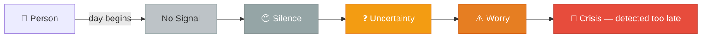
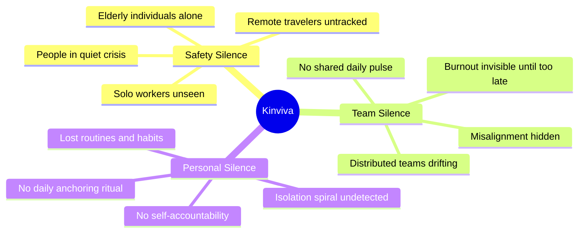
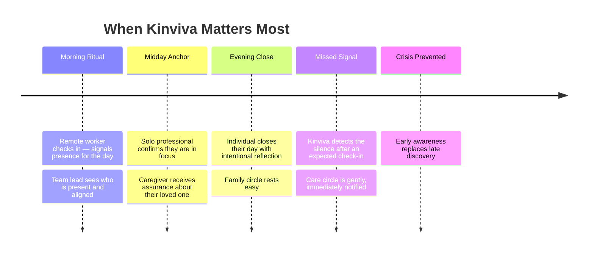
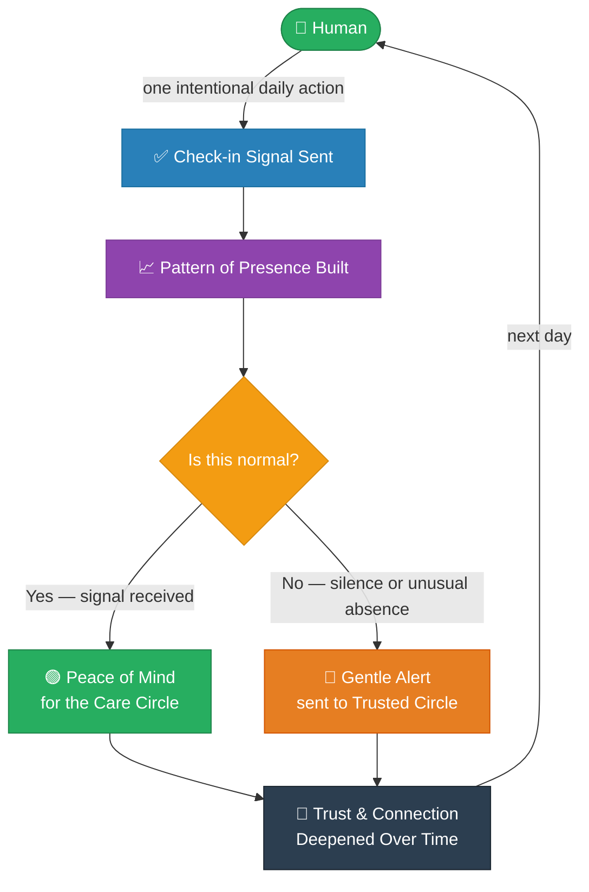
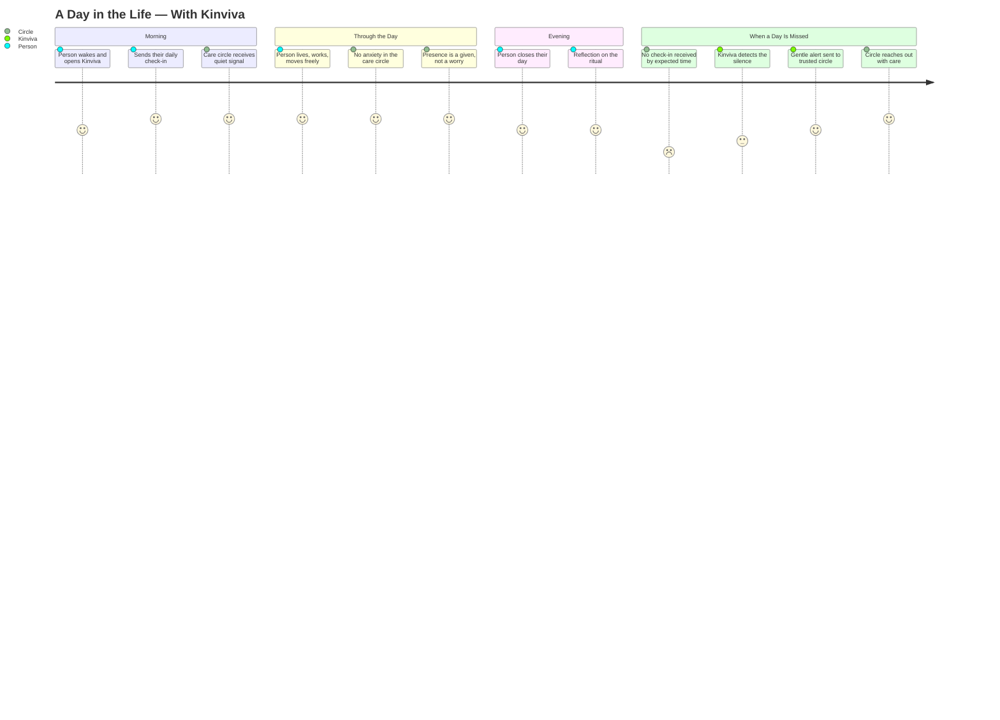
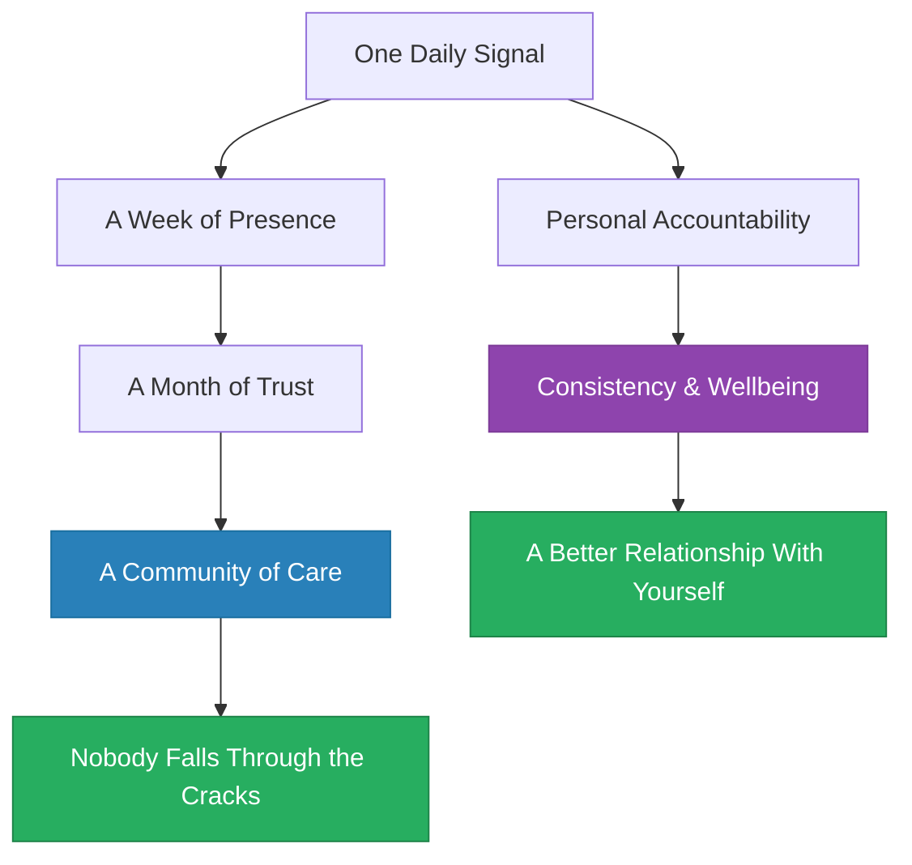

# Kinviva
### *A Daily Signal of Human Presence*

> **"The most dangerous disconnection is the one nobody notices."**


---

## The Core Idea

Kinviva is a **daily check-in ritual** — a single, intentional signal that says:

> *"I'm here. I'm okay. I'm present."*

It is not a messaging tool. It is not a tracker.
It is the answer to a simple, overlooked human need:

**Knowing that the people you care about are okay — every single day.**

---

## 🔴 The Problem

We live in a world hyper-connected by devices, yet profoundly disconnected in *presence*.

- A remote worker starts their day — nobody knows if they are okay.
- An elderly parent hasn't responded since yesterday — is it nothing, or something serious?
- A team is "online" — but no one truly knows who is struggling, present, or quietly drifting.
- A solo traveler checks into a hotel — and disappears from anyone's awareness.

**Silence is invisible. And invisible problems become crises.**



The problem is not a lack of technology.
The problem is the **absence of a shared daily ritual of presence.**

---

## WHAT is Kinviva?

Kinviva is a **daily presence platform** built around one human habit:

> **Check in. Once a day. Intentionally.**

It transforms a simple act — *"I'm here"* — into:

- A **safety net** for people who live or work alone
- A **trust signal** for distributed teams and remote communities
- A **care ritual** for families and those who watch over others
- A **personal anchor** for individuals building daily consistency

> Kinviva is not about surveillance.
> It is about **voluntary presence** — a shared agreement:
> *"We look out for each other."*

---

## WHY does it exist?

### The Three Silences Kinviva Breaks



Each silence shares the same root cause:

**There is no low-friction, daily, human signal of "I am present."**

Existing approaches either:
- Do **too much** — overwhelming tools built for other purposes
- Feel like **surveillance** — monitoring without consent or care
- Require **too much effort** — forms, calls, reports that fade fast
- Activate only in **emergencies** — when it is already too late

> **Kinviva fills the gap between "everything is fine" and "something went wrong" —
> that daily middle ground that nobody owns.**

---

## WHEN does it matter?



Kinviva matters at the **intersection of care and distance** —
wherever people who matter to each other cannot be physically present.

---

## HOW does it work?

Conceptually, Kinviva operates on three layers:

### Layer 1 — The Signal
> A human sends one intentional daily signal: *"I am here."*
> This is the foundation. Simple. Voluntary. Human.

### Layer 2 — The Pattern
> Over time, the signal builds a pattern of presence.
> What does "normal" look like for this person?
> When do they usually check in? What rhythm do they follow?

### Layer 3 — The Response
> When the pattern breaks — when silence replaces signal —
> the right people are notified, gently and without delay.



### The Core Loop

```
┌──────────────────────────────────────────────────────────────┐
│                                                              │
│   PERSON ──► SIGNAL ──► PATTERN ──► UNDERSTANDING           │
│      ▲                                      │               │
│      │                                      ▼               │
│      └──── TRUST ◄──── CIRCLE ◄──── RESPONSE                │
│                                                              │
│   When signal is MISSED:                                     │
│                                                              │
│   SILENCE ──► PATTERN BREAKS ──► ALERT ──► CIRCLE ──► CARE  │
│                                                              │
└──────────────────────────────────────────────────────────────┘
```

---

## The Problem Solved

| Without Kinviva | With Kinviva |
|-----------------|--------------|
| Silence is invisible | Silence is noticed immediately |
| Crisis is discovered too late | Patterns surface concerns early |
| Care requires constant, exhausting effort | One signal does the quiet work |
| Remote means disconnected | Remote means present by design |
| Wellness is assumed | Presence is confirmed |
| People fall through the cracks | People are held by a net of care |
| Distance creates anxiety | Distance is bridged by ritual |

---

## The Human Journey



---

## The Ripple Effect

One check-in seems small.  
But a daily check-in, sustained, creates something profound:



---

## The Bigger Vision

Kinviva is built on a belief:

> **Presence is a gift we give each other.**

In a world where isolation is quietly rising — among remote workers, the elderly, solo travelers, and anyone living far from the people they love — the simple act of checking in daily is a **radical act of care.**

Kinviva is not an app.
It is a **shared agreement** between people who matter to each other:

> *"I will let you know I'm here.  
> And if I don't — you will know to look for me."*

---

```
╔══════════════════════════════════════════════════════╗
║                                                      ║
║    KINVIVA  =  Presence  +  Pattern  +  Peace        ║
║                                                      ║
║    One signal.  Every day.                           ║
║    Nobody falls through the cracks.                  ║
║                                                      ║
╚══════════════════════════════════════════════════════╝
```

---

🌐 [kinviva.tech](https://kinviva.tech) · A product by [Cloudvoyance AI](https://www.cloudvoyance.com)
